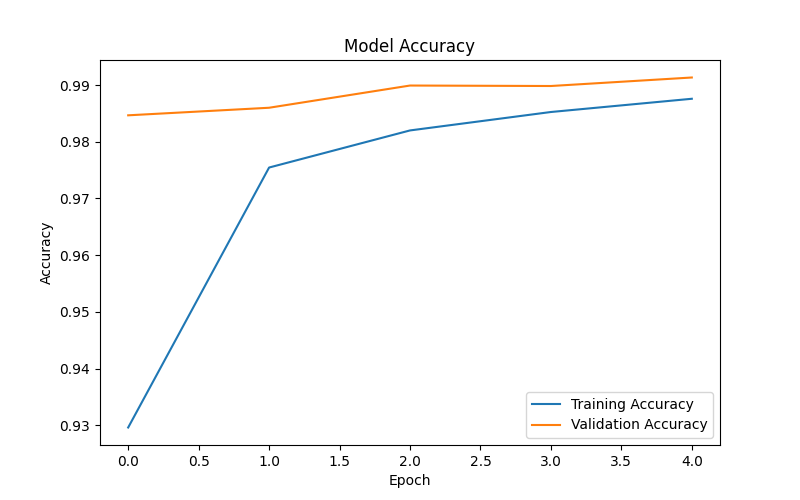
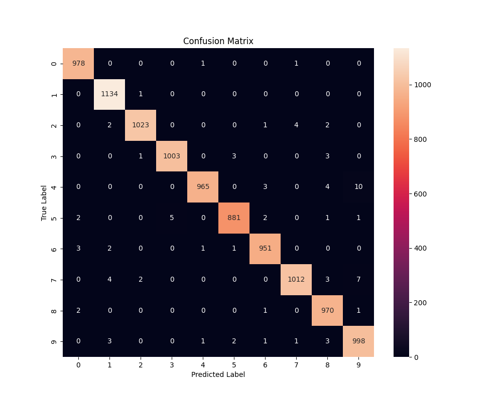

# OptimusAutomate_ImageClassification
# Image Classification with CNN

## Project Overview

This project implements a Convolutional Neural Network (CNN) using TensorFlow to classify handwritten digits from the MNIST dataset. The model is trained on grayscale images of handwritten digits (0–9) and achieves high classification accuracy on unseen test data.

---

## Features

* CNN-based image classification
* MNIST dataset training and testing
* Data preprocessing and normalization
* Accuracy visualization
* Confusion matrix generation
* Model performance evaluation
* Test accuracy of approximately **99.1%**

---

## Technologies Used

* Python
* TensorFlow / Keras
* NumPy
* Matplotlib
* Scikit-learn
* Seaborn

---

## Dataset

The project uses the **MNIST Handwritten Digits Dataset**, which contains:

* 60,000 training images
* 10,000 testing images
* 10 digit classes (0–9)

Each image is a 28×28 grayscale image representing a handwritten digit.

---

## Model Architecture

The CNN model consists of:

1. Convolutional Layer (32 filters)
2. Max Pooling Layer
3. Convolutional Layer (64 filters)
4. Max Pooling Layer
5. Flatten Layer
6. Dense Layer (128 neurons)
7. Dropout Layer
8. Output Layer (10 classes with Softmax activation)

---

## Results

The model achieved approximately:

* **Test Accuracy:** 99.1%
* **Validation Accuracy:** 99.1%

This demonstrates the effectiveness of Convolutional Neural Networks for image classification tasks.

---

## Accuracy Plot



---

## Confusion Matrix



---

## Repository Structure

```text
.
├── cnn_classifier.py
├── requirements.txt
├── accuracy_plot.png
├── confusion_matrix.png
└── README.md
```

---

## Installation

Clone the repository:

```bash
git clone https://github.com/YOUR_USERNAME/OptimusAutomate_ImageClassification.git
```

Install dependencies:

```bash
pip install -r requirements.txt
```

Run the project:

```bash
python cnn_classifier.py
```

---

## Learning Outcomes

Through this project, I gained practical experience in:

* Deep Learning
* Convolutional Neural Networks (CNNs)
* TensorFlow Model Development
* Data Preprocessing
* Model Evaluation
* Accuracy Analysis
* Confusion Matrix Interpretation

---

## Author

Developed as part of the **Artificial Intelligence Internship Program at Optimus Automate**.

